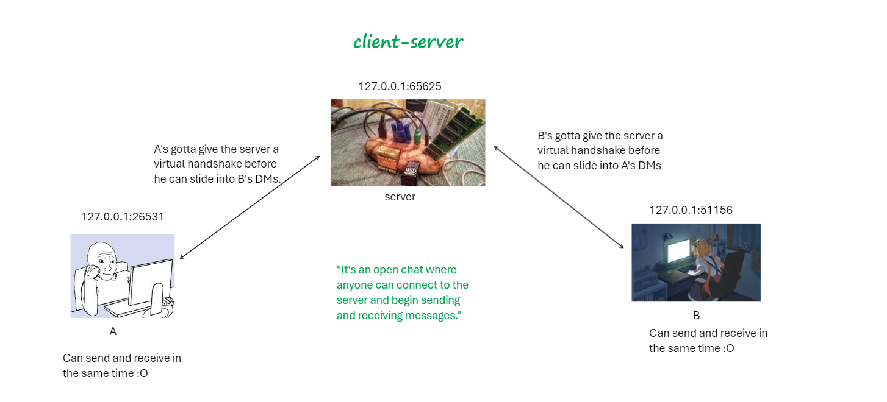
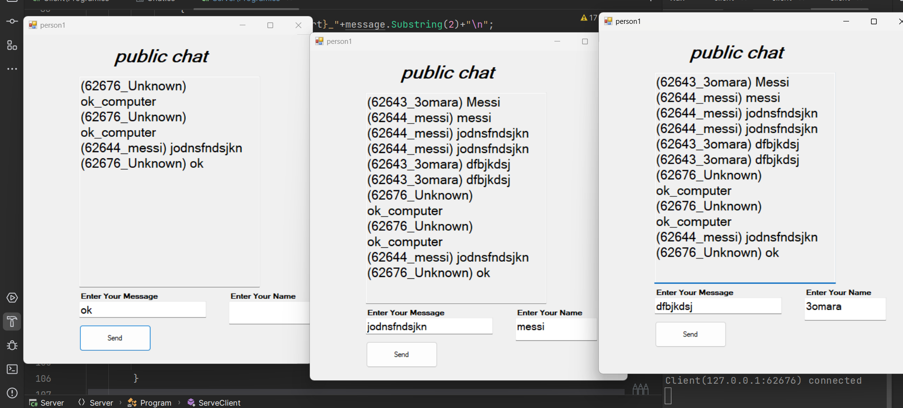

# TCP Chat Application

- The application utilizes TCP connection for communication.
- We use threads to allow the program to send and receive messages at the same time.
- Semaphores are used to protect shared resources, ensuring that threads do not interfere with each other while accessing shared data.  

