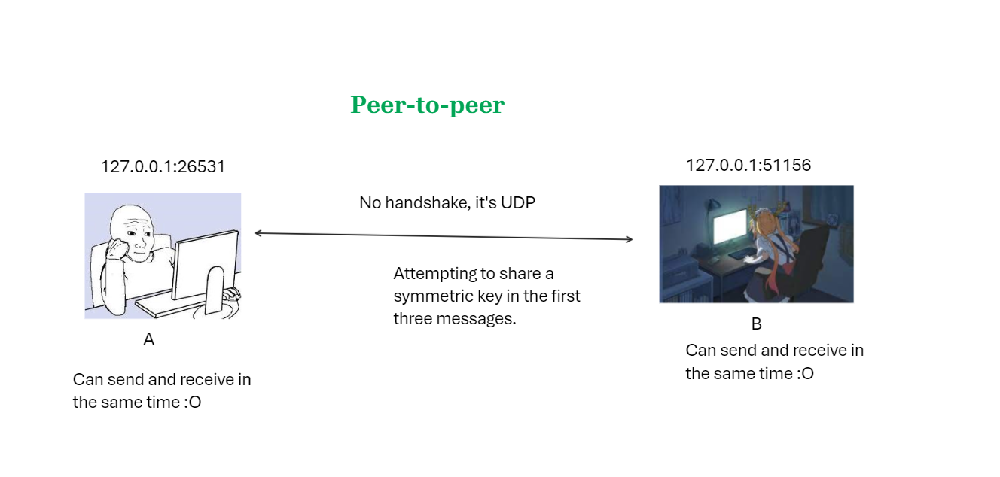
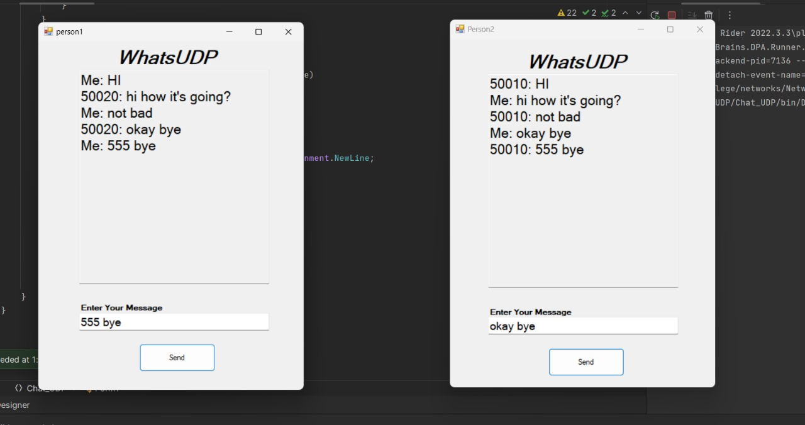
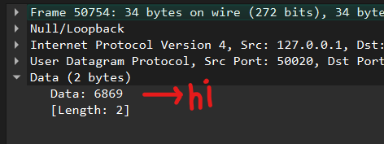
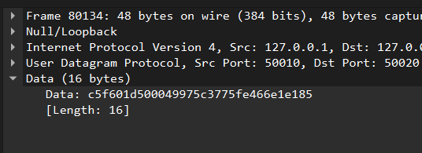

# UDP Chat Application

- The application utilizes UDP connection for communication.
- The Messages are secured using a symmetric key, which is initially sent using an asymmetric key during the first connection.
- We use threads to allow the program to send and receive messages at the same time.
- Semaphores are used to protect shared resources, ensuring that threads do not interfere with each other while accessing shared data.

## SSL

      
          |
          |
          |  encrypt it
          |  using a symmetric key
          |
          |
          V

 

